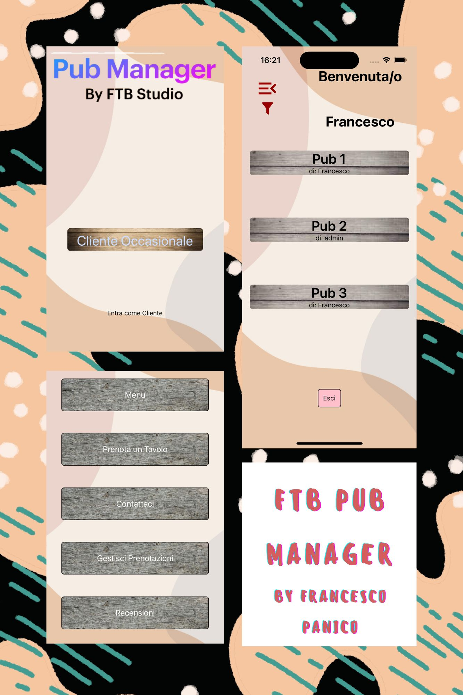

# FTB Pub Manager by FTB Studio

## A Pub Management application you have never seen before

The Pub Manager App is thought with the idea of having multiple people reaching the same app to manage (as owner
or customer) multiple Pubs which may or may not be related to each other.

  

This app allows multiple feature such as:

- Check out the menu (or create the menu if you are the owner of the Pub)
- Reserve a table
- Check out Pub contact details
- Manage your reservations
- Leave a feedback to the pub you have just spent the night!

On the App Home Page you can decide wheter you want to log in, or just check out the pub as a guest user (with limited functionalities)

After you are in, you will be presented a list of all pubs and just select the one you are curious about!

Currently available in:

- English
- Italian

## Open Source and features to come

This project is meant to be open source so anyone can contribute to it by opening a pull request or otherwise an issue.

Let's discover new features for the app yet to come:

- Adding more customization for owners (pub logo on the pub button)
- Creating a workflow enabling users to submit a registration for their pubs
- Notifications

## Techincal Details

To be able to run this app (even locally) there are few steps to pursue:

- Create a local .env file with keys
  - JWT_SECRET
  - DB_PATH
- Create a local "localconfig.json" with an Object containing the following key
  - SERVER_BASE_PATH
