# FTB Pub Manager by FTB Studio

## A Pub Management application you have never seen before

```
current version: 0.1.0

DISCLAIMER
This application is born as an excercise to learn React Native and Mobile Development itself so it probably does not follow all thier best practice.
If you think that some part can be refactored or improved, feel free to open an issue or even a pull request if you want to contribute.

Thanks

```

The Pub Manager App is thought with the idea of having multiple people reaching the same app to manage (as owner
or customer) multiple Pubs which may or may not be related to each other.


This app allows multiple feature such as:

- Check out the menu (or create the menu if you are the owner of the Pub)
- Reserve a table
- Check out Pub contact details
- Manage your reservations
- Leave a feedback to the pub you have just spent the night!

### Home Page

In the home page the user can choose between:

- Login as a customer
- Login as a guest

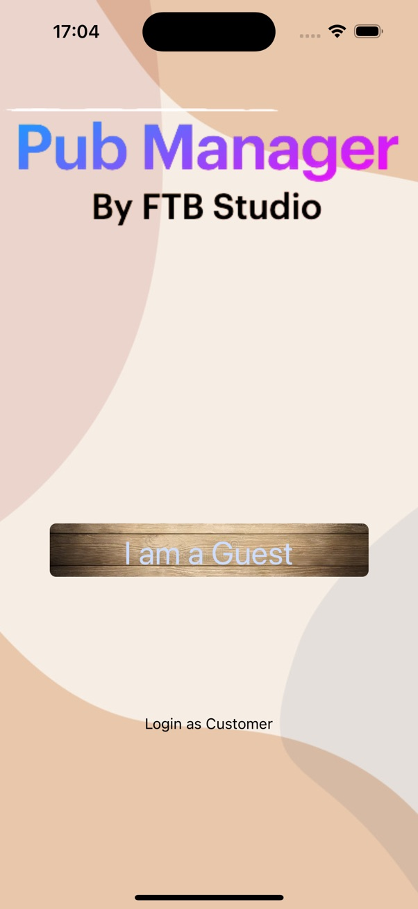
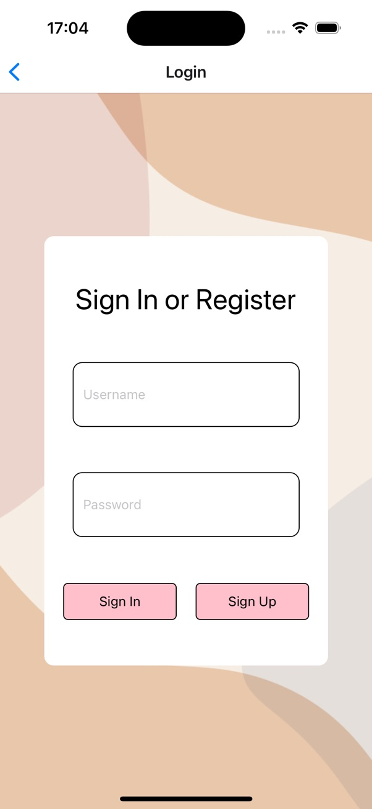

Logging as a guest allows you to simply check out which pubs are present in the app, their contacts and their menu.

As a logged in customer you have additional features such as:

- booking a table
- Writing a review

### Pub List Page

Once you have logged in, you will be presented a list of pubs

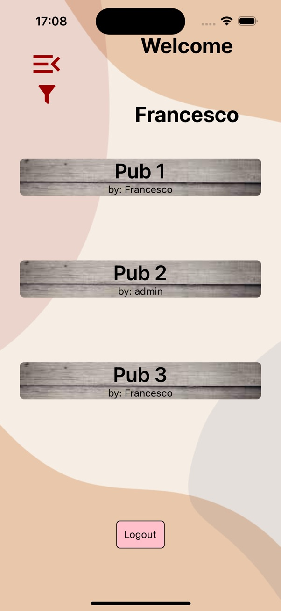

The two icons on the top left corner represent the following feature:

- Showing all reservation for the user across all pubs

- <ins>(Available only for Owners)</ins> Filter for pubs owned.

### Pub Home Page

After selecting the Pub you will be presented the following View

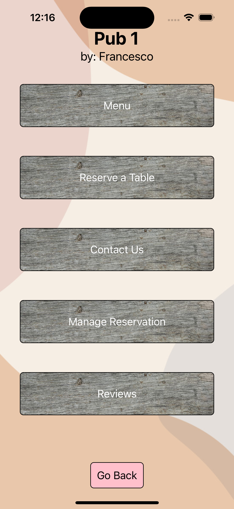

From here you can choose one of the action you are willing to do

### Menu

On the Menu page, the Menu will be show in an accordion fashion: pressing one of the voices of the menu it will expands showing all the items for that particular voice (e.g. Appetizers)

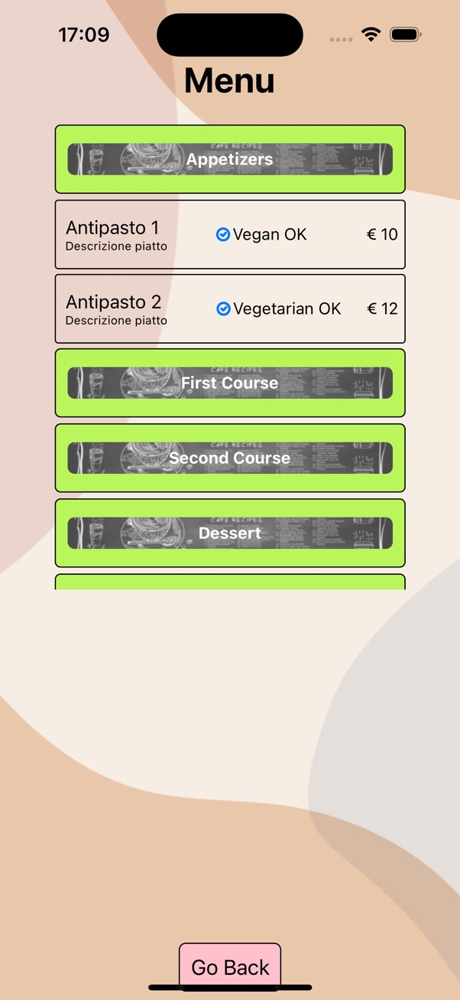
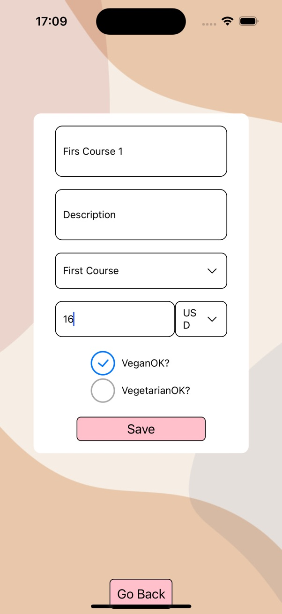

<ins>Owners</ins> can create a new Meun Item via a button that they have on the UI or edit an existing menu item by long pressing it.

### Reservations

On the reservation menu it is possible to create a Reservation filling the form.

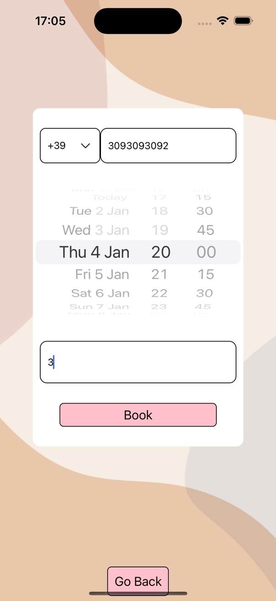

The form takes in consideration:

- Closure Days
- Closure Time
- Vacations Days

<ins>Owners</ins> can make the reservation on their pubs as well, this is thought to handle reservations that comes from other channles besides the application such as phone calls.
The reservation will have no name on it (i.e. anonymous reservation)

### Reservation Manager

It is possible to see your reservations for that particular pub on the **Reservation Manager** page

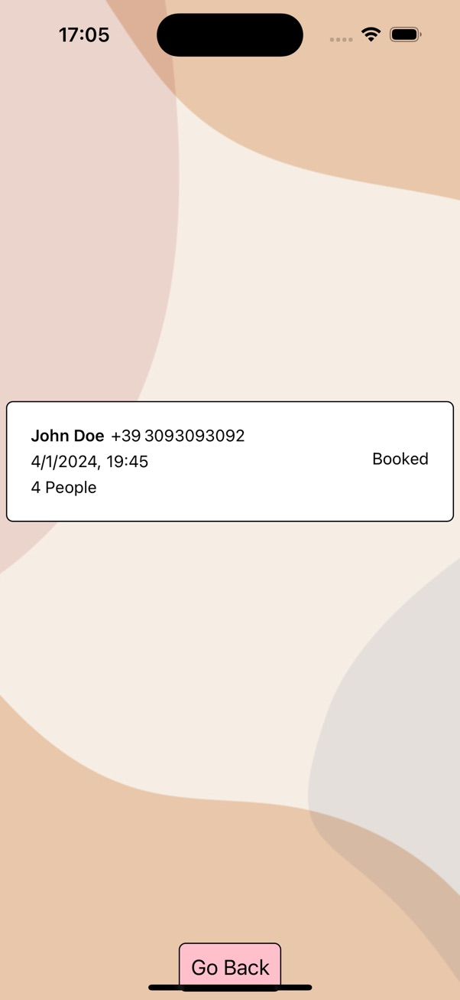
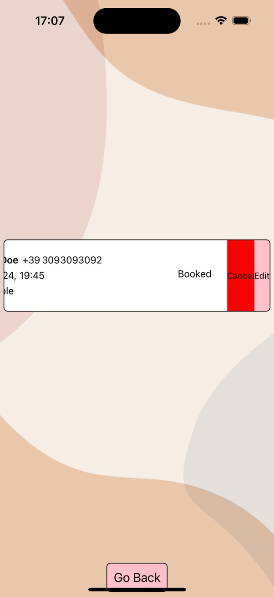
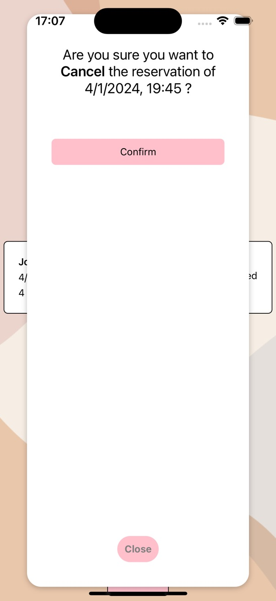
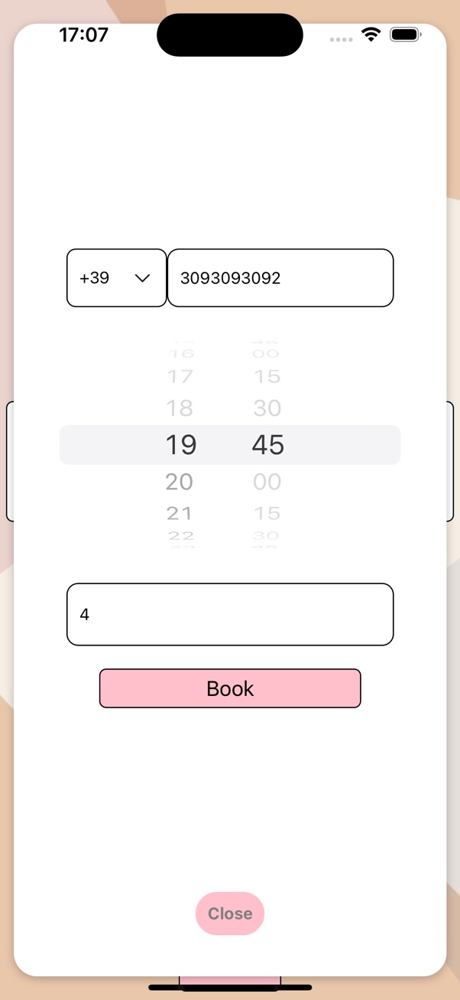

By the swipeable gesture handle from left to right it is possible to perfor actions on the reservation:

- Cancel Reservation
- Edit Reservation
- <ins>(Owner only)</ins>Edit Status Reservation

Owners can modify the Status of the reservation, e.g. from "Booked" to "Shown" as soon as the user shows herself at the Pub.

All status available are:

- Booked
- Cancelled
- Not Shown
- Shown

Once the reservation changes its status from "Booked" to any other status, it's not possible to perform any other action.

Owners can also indicates if the user has been called back.

Status and callbacks contribute to increase/decrease the score of a particular user.

As of today, the score is not used in the application but in the future it may be used to warn the pub owner of a potential fake reservation.

### Contact Info

From the Contact Info page, users can see many information about the pub such as:

- address
- closing days
- contacts
- vacations

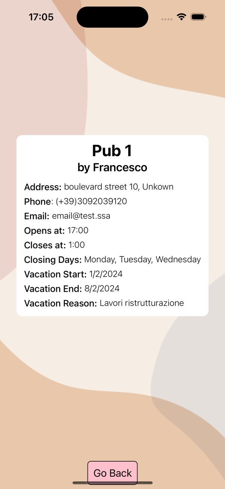

<ins>Owners</ins> have an additional button on the page to make modification about the information shown on the page.

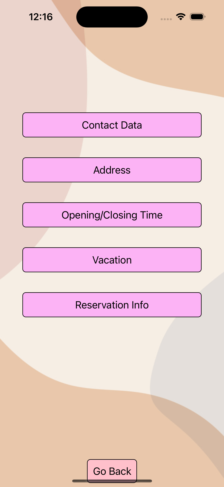
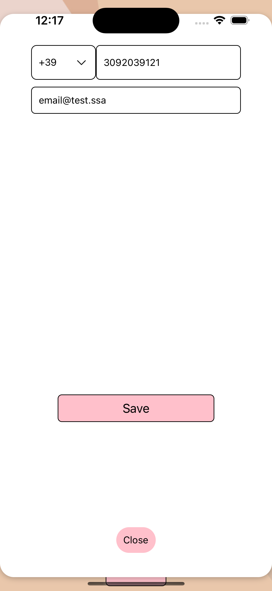
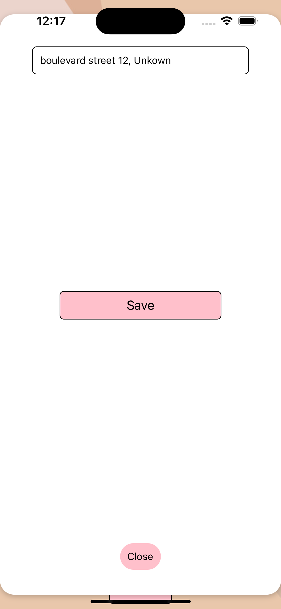
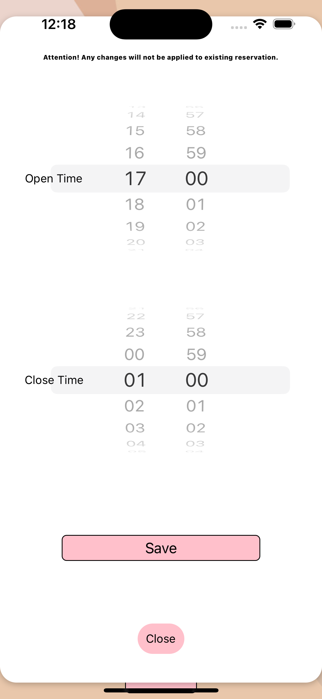
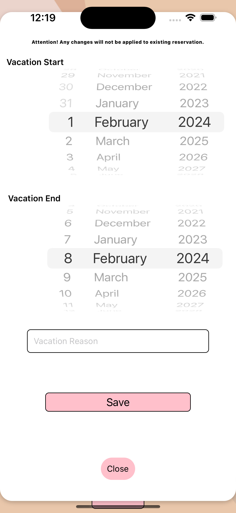
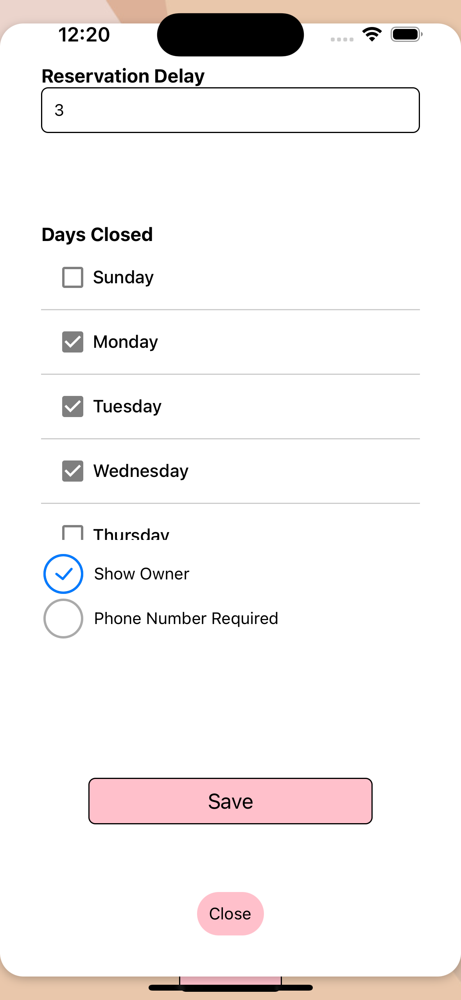

It can also modify:

- Delay (in hours) from the momnet the user is making the reservation to the hour of the actual reservation (e.g. if a owner sets up a 3 hour delay and a user is booking at 4 p.m. the first available time to make the reservation will be 7 p.m.).
- Require phone number in reservations
- Show the owner username on the pub

### Reviews

Logged users can also give a feedback to the pub via the Review service.

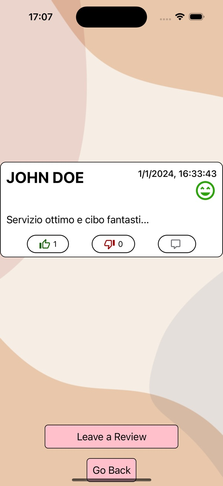

You can give a score of what your experience was at the pub

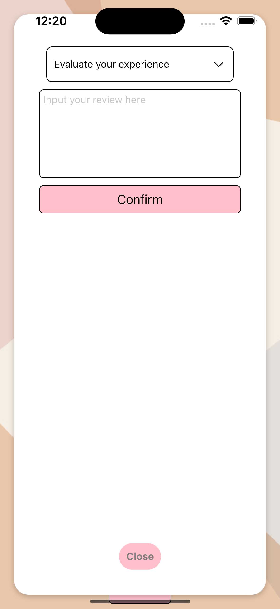
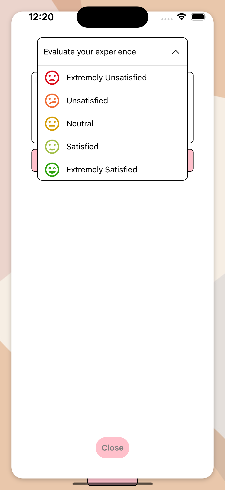

Other users can like or dislike your review, while only pub owner and the user that created the review itself can comment the review (owner of the pub is marked with a tag under the name).

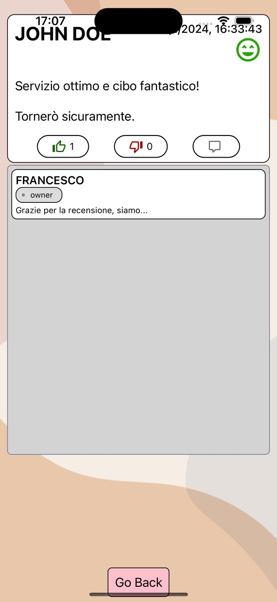

Currently available in:

- English
- Italian

## Open Source and features to come

This project is meant to be open source so anyone can contribute to it by opening a pull request or otherwise an issue.

Let's discover new features for the app yet to come:

- Adding more customization for owners (pub logo on the pub button)
- Creating a workflow enabling users to submit a registration for their pubs
- Notifications

## Techincal Details

To be able to run this app (even locally) there are few steps to pursue:

- Create a local .env file with keys
  - JWT_SECRET
  - DB_PATH
- Create a local "localconfig.json" with an Object containing the following key
  - SERVER_BASE_PATH

You can find the docker and docker compose file in the project, ready to use!
